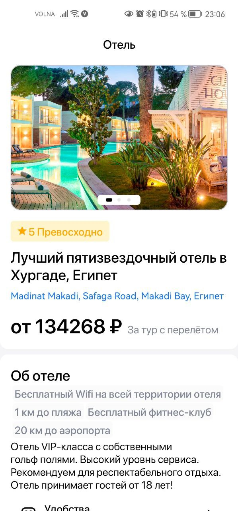
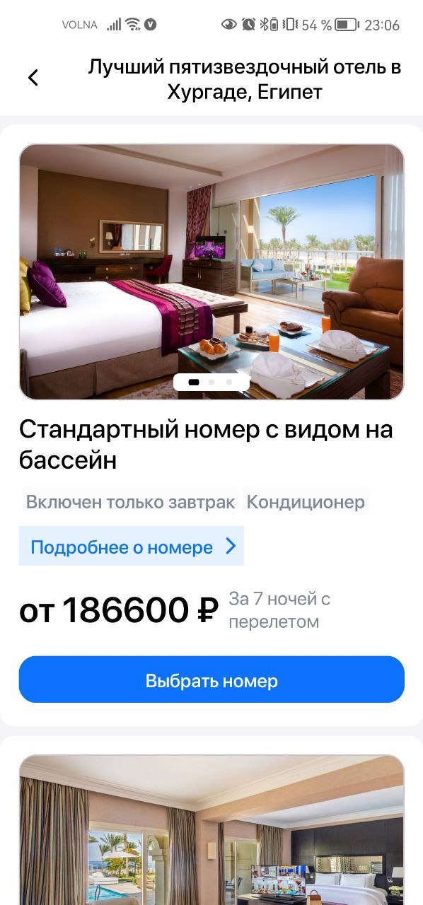
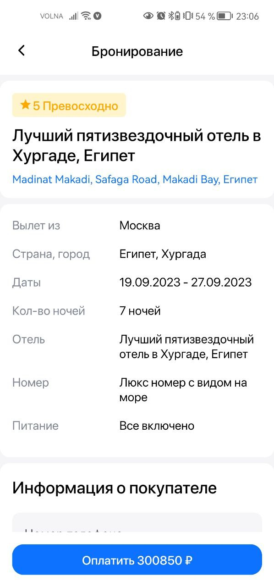
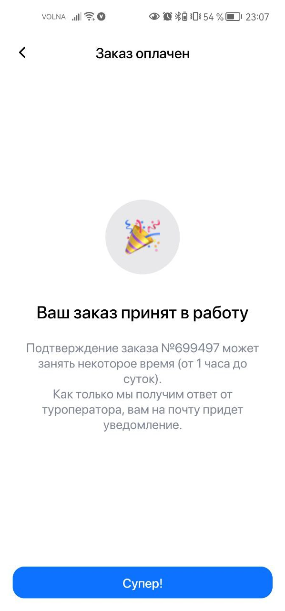

# Тестовый проект для "Effective Mobile"

## О проекте

Данный проект был разработан, как тестовое задание на вакансию Junior Android разработчик.

### Что нужно было сделать:

- Разработать приложение по данному данному дизайну и требованиям, описаным в ТЗ.

## Технический стек:

- Kotlin
- Clean Architecture
- MVVM
- Многомодульность
- ViewBinding
- DI
- Custom View

### Библиотеки:

- Coroutines
- Lifecycle(LiveData, ViewModel)
- Navigation
- Glide
- Room
- Retrofit
- GSON
- OkHttp
- MaskedEditText
- WhyNotImageCarousel
- FlexBox
- Dagger-Hilt

## Скриншоты

    
    
  
  

 

